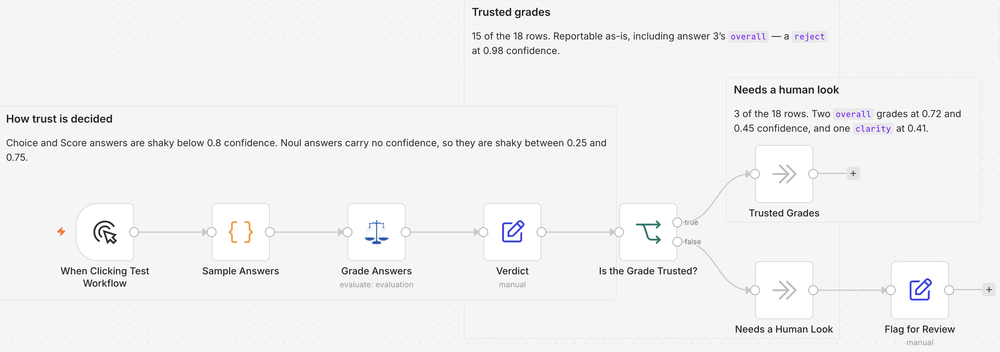

# Grade AI answers and route the shaky ones with Judgment

> **Self-hosted only.** This template uses the community node `n8n-nodes-judgment`, which cannot run
> on n8n Cloud. Install it from **Settings → Community Nodes** on your own instance before importing
> this workflow.

## Who this is for

Anyone shipping model output to users who wants a number attached to "is this answer any good?"
before it goes out. It suits evaluation pipelines, support-answer review, and any team comparing two
models on the same prompt set, where the decision to act should not rest on someone reading every
response by hand.

## What this workflow does

It grades a set of AI answers against a reference answer, then separates the grades you can act on
from the ones a person should look at.

*Sample Answers* holds three answers, each with the question it was meant to answer and a reference
answer to judge it against. The sample set is deliberately mixed: one clean answer, one that
overstates what the reference supports, and one that invents a support tier entirely.

*Grade Answers* sends each answer through a single Judgment call that asks six questions at once:
four yes/no checks (does it agree with the reference, does it answer every part, is every claim
supported, is it on topic), one clarity score on a three-point scale, and one ship/edit/reject
choice. All six run in one API call per answer, so the rubric costs what a single question would.

*Verdict* normalizes the replies into columns: `grade`, `answerId`, `value`, `score0to1`,
`judgeConfidence`, and `trust`. *Is the Grade Trusted?* then branches on `trust`, sending sure grades
to *Trusted Grades* and uncertain ones through *Flag for Review* to *Needs a Human Look*.

The interesting part is that quality and certainty are separate axes. On the sample set most grades
land on the trusted path, and answer 3 is *rejected with high confidence* — a grade the judge is
certain about, so it counts as actionable even though the verdict is negative. The handful that need
a person are all cases where the judge could not commit: the two ship/edit choices on answers 1 and
2, and the clarity score on answer 3.

Confidences shift slightly between runs, so expect roughly 15 of 18 trusted rather than exactly that
number. The shape is what matters: the shaky rows are always the confidence-bearing Choice and Score
questions, never the yes/no ones.

## Setup

1. Install the `n8n-nodes-judgment` community node from **Settings → Community Nodes**.
2. Add a **Judgment API** credential to *Grade Answers*, with an API key from your provider. Change
   the Base URL only if you are not using the default endpoint.
3. Replace *Sample Answers* with your own evaluation set. Keep the `question`, `answer` and
   `reference` fields; add fields if your rubric needs them and reference them in the questions with
   backticked paths such as `` `answer` ``.

## How to customize

The rubric lives in *Grade Answers*. Edit the six questions to suit your domain: swap a check, add
another, or drop the ones your set does not need. For a stricter correctness gate, change `clarity`
from a score to a yes/no question and delete the score normalisation in *Verdict*.

The trust rules are a single expression in *Verdict*, so re-tuning them never requires a new
inference run. Confidence-bearing answers are trusted at 0.8 or above; yes/no answers carry no
confidence at all, so they are treated as shaky only when the probability sits between 0.25 and
0.75. Raise the confidence threshold to send more grades to a person, or lower it to automate more.

Point *Trusted Grades* at your scoreboard, sheet or database, and *Needs a Human Look* at wherever a
person already reviews work.

## Notes

`value` is a string on every row, because one field has to hold both a choice label (`ship`) and a
number. Read `score0to1` and `judgeConfidence` when you need real numbers.
