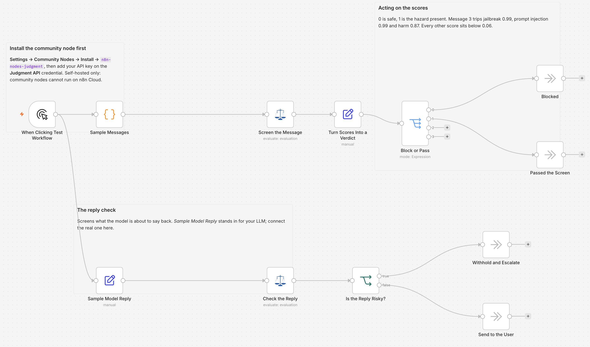

# Screen chat messages and model replies with Judgment

> **Self-hosted only.** This template uses the community node `n8n-nodes-judgment`, which cannot run
> on n8n Cloud. Install it from **Settings → Community Nodes** on your own instance before importing
> this workflow.

## Who this is for

Teams putting an LLM behind a chat interface, a support inbox, or an internal assistant, who need a
safety check on both sides of the model. It suits anyone who has been asked "what stops a user from
talking the model into something?" and wants a concrete answer rather than a prompt instruction.

## What this workflow does

It screens incoming messages before they reach your model, and screens the model's reply before it
reaches the user. Screening only one side leaves the other open.

The top row handles incoming messages. *Sample Messages* produces three examples, one of which is a
jailbreak attempt. *Screen the Message* scores five hazards for each message in a single Judgment
call: jailbreak, prompt injection, personal data, real-world harm, and self-harm. *Turn Scores
Into a Verdict* turns each hazard into a `message`, `hazard`, `risk` and `verdict`, and *Block or
Pass* splits them so risky hazards reach *Blocked* and clean ones reach *Passed the Screen*.

The bottom row handles the reply. *Sample Model Reply* stands in for your LLM's output, and *Check
the Reply* asks two questions of it: did the model obey an instruction a user injected, and did it
reveal its own system prompt. *Is the Reply Risky?* sends anything above the threshold to *Withhold
and Escalate*, and everything else through to *Send to the User*.

On the sample data the guardrail is not subtle. Message 3 trips jailbreak, prompt injection and
real-world harm at high probability, while the other two messages score below 0.1 on every hazard.
The sample reply scores highly on both compliance and leaking its prompt, so it is refused rather
than delivered.

Scores move a little between runs; the separation between the jailbreak message and the other two
does not.

## Setup

1. Install the `n8n-nodes-judgment` community node from **Settings → Community Nodes**.
2. Add a **Judgment API** credential to *Screen the Message* and *Check the Reply*, with an API key
   from your provider.
3. Replace *Sample Messages* with your real input: a chat trigger, a webhook, or a mailbox node.
4. Replace *Sample Model Reply* with your LLM node, so the reply check runs against real output
   instead of the sample.

## How to customize

The threshold lives in *Block or Pass* and *Is the Reply Risky?*, both set to 0.5. Treat it as a
starting point rather than a constant: a screen for anything cheap and reversible can sit at 0.3,
while real-world harm and self-harm deserve something closer to 0.2, because a miss costs far more
than a false alarm.

The hazard list is the main thing to tune. Add a question to *Screen the Message* for any category
your policy names, and delete the ones you do not screen for. The reply check works the same way:
extend *Check the Reply* with any behaviour you want to catch on the way out, such as leaking
personal data it was given earlier in the conversation.

The four outcome nodes are placeholders. *Blocked* should return a refusal instead of calling the
model at all; *Passed the Screen* is where your model call goes; *Withhold and Escalate* should
alert someone; *Send to the User* delivers.

## Notes

Hazard answers are probabilities, not verdicts. A score near 0.5 means the judge genuinely could not
tell, so consider treating that band as its own outcome rather than forcing it into pass or block.
Yes/no answers from the Judgment node carry no confidence value, so the probability is the whole
signal here.
