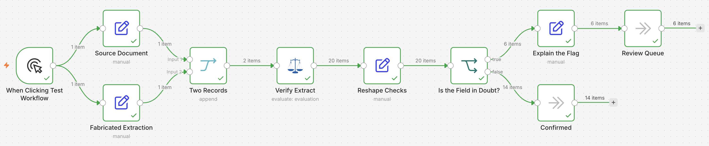

# Verify extracted contract terms and flag the fabricated ones with Judgment

> **Self-hosted only.** This template uses the community node `n8n-nodes-judgment`, which cannot run
> on n8n Cloud. Install it from **Settings → Community Nodes** on your own instance before importing
> this workflow.

## Who this is for

Anyone extracting structured data from documents with an LLM and then trusting the result. It suits
contract review, invoice processing, claims intake, and any pipeline where a wrong field is worse
than a missing one.

The failure it catches is specific: an extraction that is structurally valid but factually wrong. A
JSON schema check passes it. A field-by-field spot check from a human misses it, because the values
look entirely plausible.

## What this workflow does

It checks an extraction against the document it came from, then separates the fields that stood up
from the ones that did not.

*Source Document* and *Fabricated Extraction* are two Set nodes holding the same contract, one
per record. The first matches the document. The second claims a **90 day** notice period where the
contract says 60, and a **Norwegian** governing law where it says Swedish — two errors that are
confidently stated, plausible for the document type, and invisible to schema validation.

Both Set nodes fan out from the trigger in parallel and merge into one stream in *Two Records*, so
the two records are verified side by side rather than one replacing the other.

*Verify Extract* checks both records in one Judgment call each, asking two questions per field: is
this value absent from the source, and does the source state a different one. Five fields means ten
questions, all answered in a single request. Both questions are phrased so a **high probability means
something is wrong**, which lets one threshold govern every check.

*Reshape Checks* splits the question ID back into a field name and a check name, so one call can
cover a whole record while still reporting which field failed. *Is the Field in Doubt?* then routes
each check: doubted fields go through *Explain the Flag* to the *Review Queue*, and the rest reach
*Confirmed*.

Three of the ten checks fire on the second record and none fire on the first. The flagged fields are
exactly the two that were wrong.

## Setup

1. Install the `n8n-nodes-judgment` community node from **Settings → Community Nodes**.
2. Add a **Judgment API** credential to *Verify Extract*, with an API key from your provider.
3. Replace *Source Document* and *Fabricated Extraction* with your own extraction output. Each item
   needs `source_text` plus one field per extracted value; everything downstream works from those.
4. Add two questions to *Verify Extract* for every field you want checked, following the pattern of
   the existing ten.

## How to customize

Field names come from the keys of the `extraction` object, and each question names the field it
checks in backticks, such as `` `extraction.notice_days` ``. Adding a field to your extraction means
adding its two questions.

The threshold in *Reshape Checks* is 0.5. Lower it and more fields take the review path; raise it and
only the clearest problems are caught. Verification is cheap enough that catching too much is usually
the better mistake.

To build the full cascade, replace *Review Queue* with a stronger reasoning model that re-extracts
only the flagged fields, rather than sending them to a person. Verification tells you which two of
five fields need the expensive model, instead of spending it on the whole record.

## Notes

The two questions are worded so they do not overlap. The first asks whether the value is in the
source at all; the second asks whether the source states a different one. Keep them that narrow when
you write your own: a single question covering "hallucinated, off target, or incomplete" scores all
three as one, and the output then tells you a field is wrong without telling you how.

Each check is a yes/no question, so no confidence value comes back. The probability is the whole
signal, and a score near 0.5 means the verifier genuinely could not tell.
