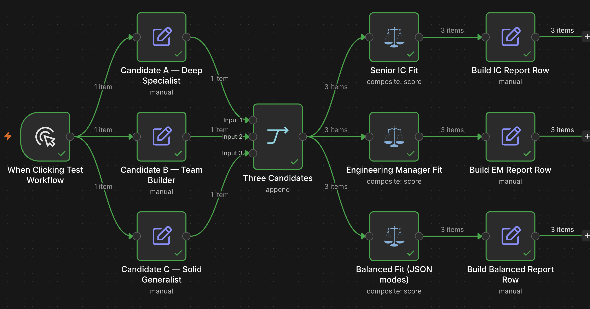

# Rank candidates by role fit with weighted scoring in Judgment

> **Self-hosted only.** This template uses the community node `n8n-nodes-judgment`, which cannot run
> on n8n Cloud. Install it from **Settings → Community Nodes** on your own instance before importing
> this workflow.

## Who this is for

Anyone screening a list of people, vendors or applications against criteria that carry different
weight depending on the role. It suits recruiting, partner evaluation, grant or funding review, and
any shortlist where "best overall" depends on what you are hiring for.

It also answers a question most scoring pipelines cannot: when the ranking comes out wrong, which
part of it was wrong, and what changes if the priorities change.

## What this workflow does

It rates three candidates on four dimensions, then scores those same ratings against two different
role profiles.

The three candidates are Set nodes, and they are chosen to make the weighting visible. *Set Candidate A Profile* is extreme on hands-on depth and system design and has never managed anyone. *Set Candidate B Profile* is the opposite: a manager with strong leadership and breadth and little recent hands-on work. *Set Candidate C Profile* is deliberately mid on every dimension, so the weights decide where they land rather than the
ratings.

Both scoring nodes rate all three candidates on the same four dimensions in one judgment call:
depth, leadership, design, and breadth, on a shared five-point scale. The dimensions and the scale
are identical in both nodes. **Only the weights differ.**

The result is the point of the template:

| Candidate | Senior IC fit | Engineering Manager fit | Equal weights |
|---|---|---|---|
| A — Deep Specialist | **~83%** | ~59% | ~70% |
| B — Team Builder | ~45% | **~69%** | ~60% |
| C — Solid Generalist | ~40% | ~39% | ~39% |

A is the strongest candidate for one role and the weakest for the other. Ratings move a little
between runs, so treat these as the pattern rather than fixed numbers — the ordering is stable, the
decimals are not.

The ranking inverts. A is the strongest candidate for one role and the weakest for the other, from
the same ratings, with no second API call.

Each role has its own report node, *Prepare IC Report Data* and *Prepare EM Report Data*, plus
*Prepare Balanced Report Data* for the equal-weight baseline. Each produces one row per candidate with
the combined score as a percentage, a `roleProfile` label saying which weighting produced it, and
the per-dimension breakdown so a score can be explained rather than asserted.

## Setup

1. Install the `n8n-nodes-judgment` community node from **Settings → Community Nodes**.
2. Add a **Judgment API** credential to *Evaluate IC Role Fit* and *Evaluate EM Role Fit*.
3. Replace the three candidate Set nodes with your own source. Each item needs one `profile` field
   holding the text to rate; an HTTP or Sheets node works in place of the Sets.
4. Edit the four dimensions and the shared scale in either scoring node to match your rubric. Both
   nodes must declare the same dimensions, since their weights refer to them by name.

## How to customize

The weights live in the weight rows on each scoring node. They are applied by the node, not the
model, so changing one re-ranks the candidates immediately. That is the reason to score this way
rather than asking a model for a single overall rating: the parts stay separate, visible, and
re-tunable.

To score another role, copy a scoring node and change only its weights. Adding a dimension means
adding it to both nodes; until it has a weight, it counts as 1.

The row-based modes read better on a canvas, so both role profiles use them. *Balanced Fit (JSON
modes)* shows the other shape: the same four dimensions and the same scale, supplied as JSON with
every weight set to 2. That is the form to reach for when the rubric is generated upstream, for
example a role definition fetched from your applicant tracking system, because it can be built with
an expression instead of typed into rows.

## Notes

The weighted score is a weighted average over each dimension's normalized value, so a dimension
scored 3 out of 4 contributes 0.75 before its weight is applied. All four dimensions share one
five-point scale here, which keeps the arithmetic easy to follow.

Each dimension comes back with a position on the scale and a confidence. The confidence is not
thresholded in this template, because the two profiles disagree by a wide enough margin that it
does not change the ranking — but on a closer shortlist, gating the review on it is the natural next
step.
