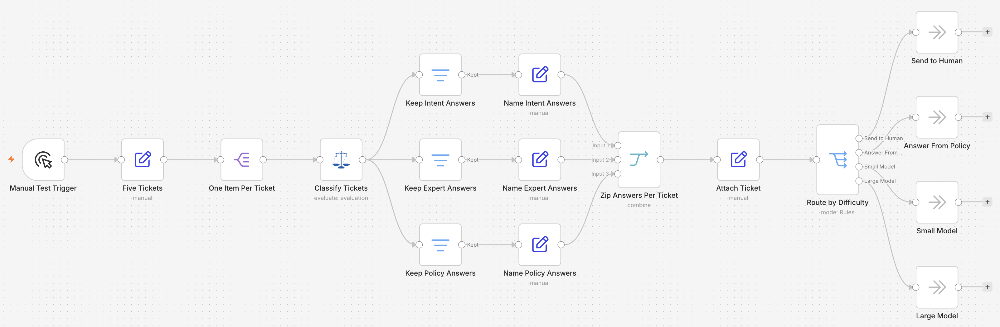

# Route support tickets to a small or large model by difficulty with Judgment

> **Self-hosted only.** This template uses the community node `n8n-nodes-judgment`, which cannot run
> on n8n Cloud. Install it from **Settings → Community Nodes** on your own instance before importing
> this workflow.

## Who this is for

Teams paying a frontier-model price for every support ticket, including the ones asking where a
setting lives. It suits helpdesks, inbox triage, and any pipeline where the same request types
arrive repeatedly but vary wildly in how much thought they need.

The saving is not from answering badly. It is from noticing that most tickets never needed the
expensive model in the first place.

## What this workflow does

It reads each ticket, decides how hard the ticket is, and sends it to the cheapest destination that
can handle it.

*Five Tickets* holds a batch in one field, and *One Item Per Ticket* splits it into five items. That
is the shape a helpdesk export or webhook arrives in, and it means the classifier runs once per
ticket rather than once per batch.

*Classify Tickets* asks three questions of each ticket in a single call: what the intent is, whether
answering it needs reasoning beyond routine procedure, and whether a short standard answer exists.
The third question is what makes the routing work. A settings question and a billing question are
both easy, but only one of them has a documented answer that needs no model at all.

Each question id carries the ticket id, so an answer arrives as `T-1001_intent_choice` rather than
`intent_choice`. That is what lets the workflow sort answers back into tickets without keeping any
state: three Filters split the answers by question, three Set nodes rename the fields so they can be
combined, and *Zip Answers Per Ticket* pairs the three lists into one item per ticket.

*Route by Difficulty* then splits the tickets four ways. On the sample batch:

| Ticket | Intent conf. | Needs reasoning | Standard answer | Destination |
|---|---|---|---|---|
| T-1001 — where is the email setting | 1.00 | 0.14 | 0.80 | Canned answer |
| T-1002 — support hours | 0.92 | 0.03 | 0.79 | Canned answer |
| T-1003 — nightly job deadlocking | 1.00 | 0.92 | 0.11 | Large model |
| T-1004 — charged twice | 1.00 | 0.29 | 0.15 | Small model |
| T-1005 — accrual reversal question | **0.28** | 0.90 | 0.15 | **Human** |

**The human branch is the important one.** T-1005 reads like a billing question but is really an
accounting question, and the classifier said so plainly: it picked an intent at 0.28 confidence,
which is close to a coin toss. Sending that to a model would have meant paying to have something
guessed at. Low confidence is a routing signal in its own right, and it is worth checking before
the difficulty question, because a ticket nobody understood should not be sorted.

## Setup

1. Install the `n8n-nodes-judgment` community node from **Settings → Community Nodes**.
2. Add a **Judgment API** credential to *Classify Tickets*.
3. Replace *Five Tickets* with your own source. Each entry needs a `ticketId` and a `ticket` field;
   a helpdesk node or a webhook fits here, and the split step works the same either way.
4. Attach a small chat model to *Small Model* and a larger one to *Large Model*. All four
   destinations, including *Send to Human*, are No-Op placeholders so the template runs with only
   the Judgment credential configured.

## How to customize

The thresholds are in *Route by Difficulty*, not baked into the questions, so changing them
re-routes the same tickets without another inference call. Raising the standard-answer threshold
sends more tickets to a model; lowering it keeps more of them free.

Tune the confidence gate first. It sits at 0.6, so any ticket whose intent was picked with less
confidence than that goes to a person. Raise it and more tickets reach a human, which is the safe
direction for anything customer-facing; lower it and more are handed to a model. Note that
confidence is only reported for Choice and Score answers, so this gate relies on the intent
question specifically.

To add a route, add a question to *Classify Tickets* and a rule to the Switch. Intent is returned
as a label, so routing on `how_to` or `incident` needs no new question at all.

All four destinations are deliberately empty. *Send to Human* should reach your ticketing queue or
a person; *Answer From Policy* should reach your knowledge base or a canned reply; and the two model
branches are where your own model nodes attach.

## Notes

The template contains no Code nodes. The sorting is done with Filters, Set nodes and a positional
Merge, so every step is inspectable without reading JavaScript.

That design has one thing to know about: *Zip Answers Per Ticket* pairs the three answer lists **by
position**, so if a ticket is ever missing an answer, every ticket after it shifts onto the wrong
branch. The classifier answers every question for every ticket in normal operation, and a missing
answer is visible as a shorter list, but if your source can produce partial answers, check the three
list lengths before the zip rather than trusting the alignment.

Each ticket costs one API call regardless of how many questions are asked, because questions in a
request run in parallel.

The classifier runs once per ticket. A request carries one state and returns one answer per
question, so there is no way to batch several tickets into a single call and get their answers back
separately — the answers would come back for the batch as a whole. `Evaluate` on one item at a time
is what produces a correct answer per ticket, and n8n drives that loop for you.
